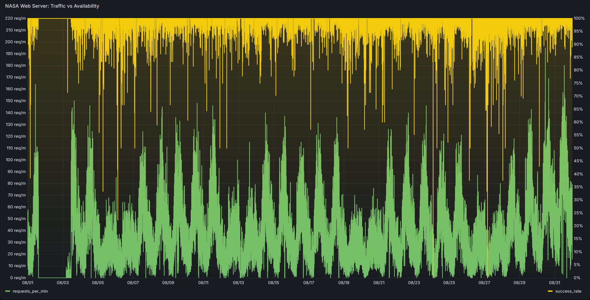

# [DevOps Action] Infrastructure Observability: NASA HTTP Access Log Pipeline

Internal Reference: DevOps Action Infrastructure Case Study

📊 Project Context
In a professional SRE (Site Reliability Engineering) environment, raw logs are only as valuable as the actionable insights extracted from them. This project implements a comprehensive **End-to-End Analytics Pipeline** to process 1.5 million raw HTTP requests (3.4GB) from NASA’s 1995 server logs.

The goal was to evaluate infrastructure resilience during extreme environmental stress (Hurricane Erin) and automate anomaly detection using a modern observability stack: **Python → PostgreSQL → Grafana**.

## 🛠 Tech Stack
* **Language:** Python (Pandas, Re, SQLAlchemy)
* **Database:** PostgreSQL (Relational storage & Time-series optimization)
* **Observability:** Grafana

📂 Dataset Infrastructure & Access
Source: [NASA HTTP Access Logs (Kaggle)](https://www.kaggle.com/datasets/adchatakora/nasa-http-access-logs) 

Volume: 1.5M+ Requests

Note on **access.log:** Due to GitHub's file size limitations for the raw 200MB+ dataset, the source file is excluded from this repository. To reproduce this analysis, download the log file from the Kaggle link above and place it in the root directory.

## 🚀 Key Technical Achievements

* **Hybrid ETL Pipeline:** Developed a high-performance **Python-based parser** using **Regular Expressions (Regex)** to transform 3.4GB of unstructured strings into a structured schema (Host, Timestamp, Method, URL, Status, Size).
* **Database Optimization:** Migrated cleaned data to **PostgreSQL** using `SQLAlchemy`, implementing **B-tree indexing** on temporal columns to ensure sub-200ms query performance for time-series visualization.
* **Time-Series Integrity:** Resolved data integrity issues by handling **non-monotonic timestamps** and timezone offsets, enabling precise chronological incident reconstruction.

---

## 🛡️ Key SRE Deliverables

### 1. Incident Post-Mortem: Hurricane Erin Recovery
A forensic analysis of the total system shutdown (Aug 1–3, 1995) was conducted to evaluate Disaster Recovery (DR) protocols:
* **Cold Boot Stability:** Audited the first 4 hours of system restoration, identifying a **99%+ Success Rate**.
* **Traffic Volatility:** Documented a post-incident **200% surge** in request volume to assist in future Capacity Planning.

### 2. Infrastructure Routing & Audit
* **302 Redirect Mapping:** Validated **26,429 redirect events** to ensure zero breakage of legacy URL structures and maintain routing integrity.
* **SLI Definition:** Established baselines for tracking **4xx/5xx error distributions**, enabling proactive root-cause analysis for broken links and server-side crashes.

### 3. Stakeholder Interoperability (Hybrid Workflow)
This pipeline bridges the gap between Engineering and Executive Leadership:
* **Engineering Layer:** Generates 1-minute resolution datasets optimized for **Grafana** dashboard ingestion.
* **Executive Layer:** Synthesizes granular logs into high-level KPI summaries for reporting in **Microsoft Excel**, focusing on downtime impact and recovery speed.

---

## 📊 Observability Preview

*The dashboard tracks Service Level Indicators (SLIs) including Request Rate (RPM) and Global Error Rates (0.65%).*

## 📁 Repository Structure
* `NASA-Log-Analysis-SRE-Observability-Pipeline.ipynb`: Main Jupyter Notebook with ETL and Forensic logic.
* `grafana/`:
    * `nasa_monitoring_august_1995.json`: Exported Grafana configuration for dashboard reproduction.
    * `dashboard-preview.png`: Preview of the monitoring suite.
* `README.md`: Project documentation and technical summary.

---

## ⚙️ How to Deploy
1.  **ETL:** Execute the Jupyter notebook to parse raw logs and migrate data to PostgreSQL.
2.  **Database:** Ensure the `timestamp` column is indexed for optimal performance.
3.  **Visualization:**
    * Connect PostgreSQL as a data source in Grafana.
    * Import `grafana/nasa_monitoring_august_1995.json`.

---
*Developed as a professional observability framework to demonstrate large-scale log processing and infrastructure health monitoring.*
